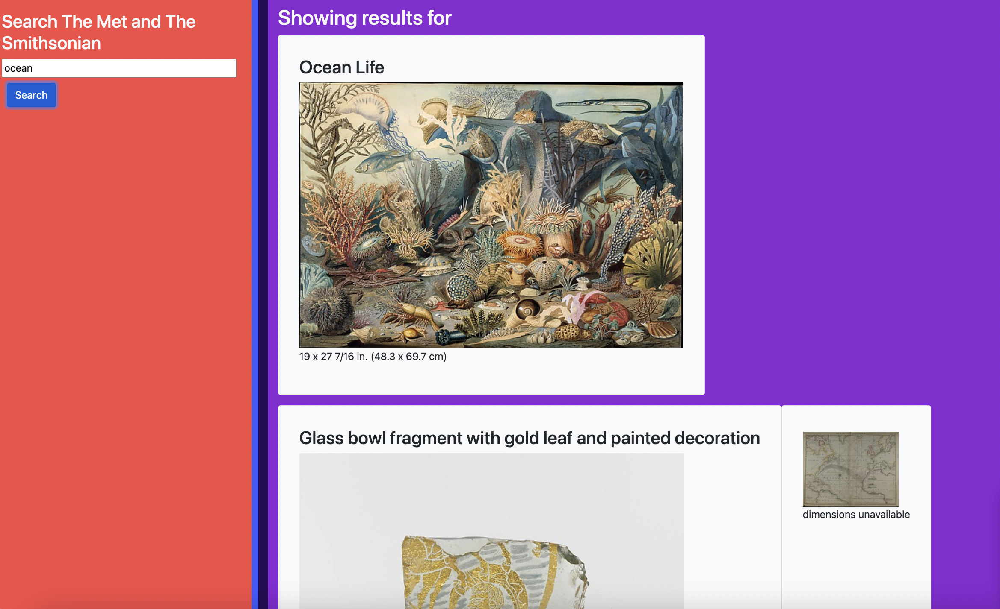

# Unit 07: Project 1 (Group 4: Art Gallery)

## Overview

Group 4 collaboratively createed a web application that conceives and executes a design integrating data received from multiple server-side API requests.

## Products & Services

It offer software using a web API that manages the art galleries/museums (Smithsonian Institution and Metropolitan Museum of Art Met Collection) providing the general information about the art pieces. Our web application serves and provides the convenience to access the information before visiting the museums or art galleries.

## User Story

- Type of User - Museum Visitors, Curators, art professionals, etc.
- Goal - To provide hands-on information about art pieces, galleries, etc.
- Benefit - Convenience for the visitors and art professionals to access and search the information about the style, artist, and true size and dimensions of the art pieces outside of the museums

## Resources

- https://github.com/Emanconcepcion/art-gallery
- https://emanconcepcion.github.io/art-gallery/
- https://www.programmableweb.com/api/smithsonian-institution-open-access-rest-api-v10
- https://www.programmableweb.com/api/metropolitan-museum-art-met-collection-rest-api-v10

## Screenshot

